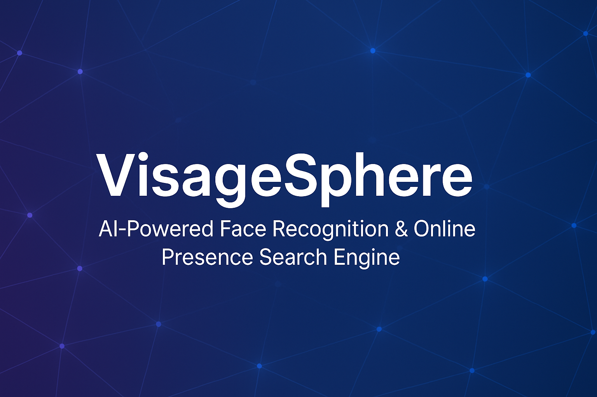

# 🌀 VisageSphere — AI-Powered Face Recognition & Online Presence Search Engine

## 🌟 Introduction

**VisageSphere** is a cutting-edge educational and research-oriented side project dedicated to exploring the fields of Artificial Intelligence, Face Recognition, Computer Vision, and Real-time Web Data Integration. This project allows users to upload or capture a photo, livestream, or recorded video and instantly identifies faces, searching the open web in real-time to retrieve publicly accessible information like social media profiles and other public mentions.

Built purely for educational and research purposes, VisageSphere demonstrates the fascinating intersection between face recognition technologies and open-source intelligence (OSINT).

---

## 🎯 Project Objectives

- **Explore advanced Face Recognition techniques** using open-source AI technologies.
- **Research and demonstrate real-time Web Crawling & Data Retrieval methods**.
- **Learn and experiment** with modern application development tools including FastAPI, Flutter, and AI libraries (OpenCV, DeepFace).
- Understand and address important aspects such as **data privacy, ethics, and legal considerations** involved in AI-based personal recognition technologies.

---

## 🛠️ Technical Stack (Educational Focus)

| Technology              | Purpose                                 | Educational/Research Aspect                         |
|-------------------------|-----------------------------------------|------------------------------------------------------|
| **Flutter**             | Cross-platform UI/UX                    | Learn hybrid application development                |
| **FastAPI (Python)**    | Backend API & AI processing             | High-performance API & real-time AI integration     |
| **OpenCV & DeepFace**   | Face recognition                        | Research advanced computer vision methods           |
| **SQLite**              | Basic local data storage                | Experiment with minimalistic database management    |
| **Scrapy/BeautifulSoup**| Real-time web crawling                  | Practice real-time data acquisition & OSINT methods |

---

## 📌 Key Features

- **Real-Time Face Recognition**: Immediate detection and identification of faces from any provided image or video source.
- **Open-Source Intelligence Integration**: Instantly retrieve and aggregate publicly available web data related to identified individuals.
- **Cross-Platform Interface**: User-friendly application built using Flutter, runnable on Web, Android, and iOS.
- **Privacy-Oriented Architecture**: Temporarily processes images without storing sensitive personal data.
- **Ethical & Legal Research**: Emphasizes learning and exploring AI ethical frameworks, privacy guidelines (GDPR, CCPA), and responsible use of data.

---

## 📚 Educational & Research Insights

This project is intended for personal skill-building, exploration, and practical research in areas including but not limited to:

- Artificial Intelligence (Machine Learning, Deep Learning)
- Computer Vision Techniques & Face Recognition Models
- Real-Time Data Processing & Crawling
- Application Development with Flutter and FastAPI
- Ethical and Legal Challenges in AI Development

---

## ⚖️ Legal & Ethical Disclaimer

- **VisageSphere** is developed strictly for educational, demonstration, and research purposes.
- **No data is persistently stored**, complying with privacy standards and ethical guidelines.
- All data fetched and displayed is public information available openly on the internet.
- Users must respect the privacy and rights of individuals identified through this software.  
- The author assumes **no liability** for any misuse or inappropriate handling of this research tool.

---

## 🚧 Future Improvements & Research Directions

* Advanced face recognition model tuning and comparisons.
* Improved scalability with Docker containerization.
* Integration with cloud AI services for performance comparisons.
* Deeper exploration of privacy-preserving AI techniques.

---

## 🤝 Contributing & Learning Together

Contributions, suggestions, and questions are welcome! If you're interested in AI and software development, this project aims to be an accessible platform for shared learning and exploration.

---

## 📄 License

This project is licensed under the MIT License — see the [LICENSE](LICENSE) file for details.

---

🌐 **VisageSphere:** *Exploring AI, One Face at a Time.*
